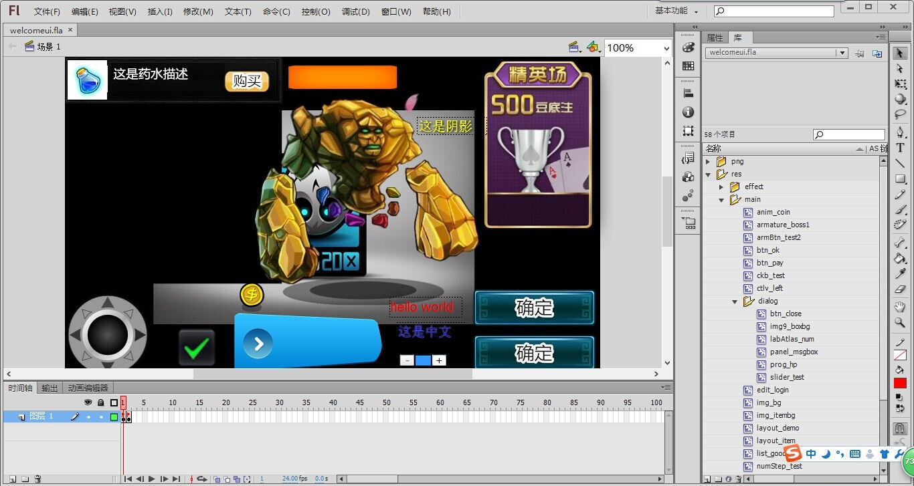
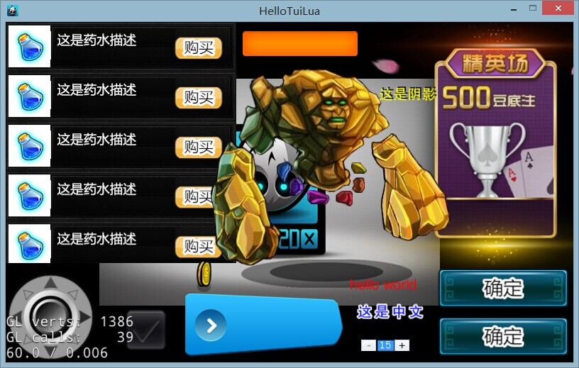

Tui-x
=====

This Tui-x cocos2dx 3.0 version,more light,more sample,more flexible

简介：

Tui是一个创建cocos2d-x UI界面的解决方案，而builder用的则是FlashCS，这个项目所用的版本是cocos2d-x 3.0正式版，
而所用的组件库为CocosWidget3.0，如果是2.2.x版本的项目请移步到https://github.com/LingJiJian/tui/tree/Tui-x

新增:

1.Tui-x3.0所采用的是RapidXml解析库，效率是tinyxml的50倍。									
2.FlashCS上可视化编辑文本描边和阴影和对齐。												
3.FlashCS上可视化编辑ListView。														
4.FlashCS上添加命名空间，避免资源命名冲突或过长。											
5.支持多fla编辑场景。																		
6*.影片剪辑控件MovieView，动画编辑工具后期发布。	
7.旋转菜单控件		
8.可视化编辑Cell。								

说明:

注：本项目中有个叫HelloTui的演示工程，需要自己放置引擎代码到相应的位置。											
Cpp具体操作为：下载好的cocos2dx3.0的引擎，然后直接把这个引擎改名成cocos2d，复制到Tui-x/HelloTuiCpp下，				
(Lua具体操作为：下载好的cocos2dx3.0的引擎，然后直接把这个引擎改名成cocos2d-x，复制到Tui-x/HelloTuiLua/frameworks下，)		
然后打开cocos/ui/UILayoutDefine.h , 注释掉 54行 //const Margin MarginZero = Margin(); 
接下来双击sln就可以开始编译了！

（为什么要这么做？这是因为我们不需要用到官方的UI库，我们只用CocosWidget的组件就能完全替代它，如果你不注释
这一行，那么vs在编译的时候，会发现Margin未定义，如果你不想注释也可以，但你必须要引入官方的UI库，那你就
有两个组件库了。。何必呢- -）

教程：
注意：Tui-x 3.0和Tui-x 2.2.x接口有少量区别！具体请看HelloTui							
在Tui-x 2.2.x的项目里有篇教程，编辑器的用法都是同样的，大家可以自行下载。
请戳 https://github.com/LingJiJian/tui/tree/Tui-x